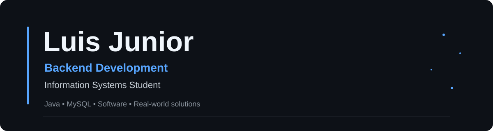

## About Me

I'm currently focused on **Java** and **databases**, building the backend skills I want to turn into my career.

What motivates me is creating software that solves real problems. I enjoy understanding how businesses work and developing systems that make everyday processes simpler and more efficient.

Right now, I'm diving deeper into Java and MySQL, and I'm really enjoying this direction. My goal is to become a backend developer capable of building reliable and useful applications.

Outside of programming, I'm an outgoing person who enjoys games, anime and learning new things. My long-term ambition is to build products, lead projects and eventually create my own technology and marketing company.

<h2>Currently Learning</h2>

  
  

  <strong>Focus:</strong> Backend Development • Object-Oriented Programming • Databases

