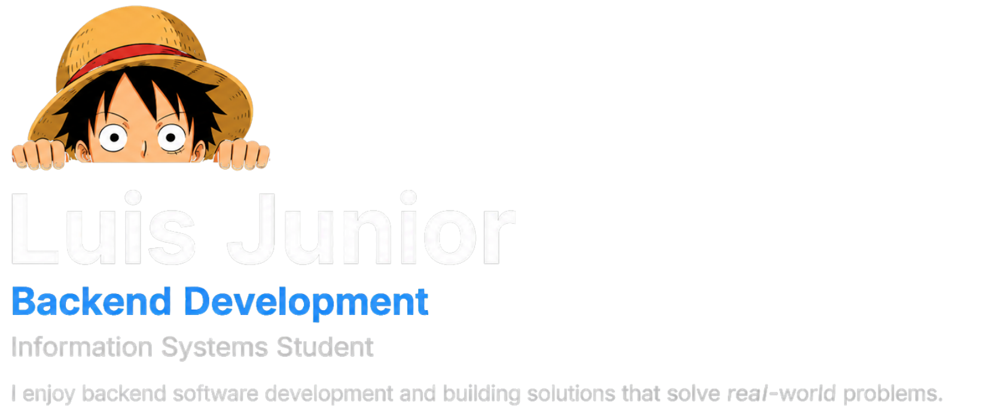

# About Me

  I'm an Information Systems student with a growing focus on backend development. I enjoy understanding how things work and turning ideas into practical software solutions.

What interests me most about software is its ability to solve real problems. I want to build systems that make processes easier, improve the way businesses work, and create useful solutions for people.

I'm still exploring where technology can take me, but my long-term goal is to build products, lead projects, and eventually create my own technology and marketing company.

